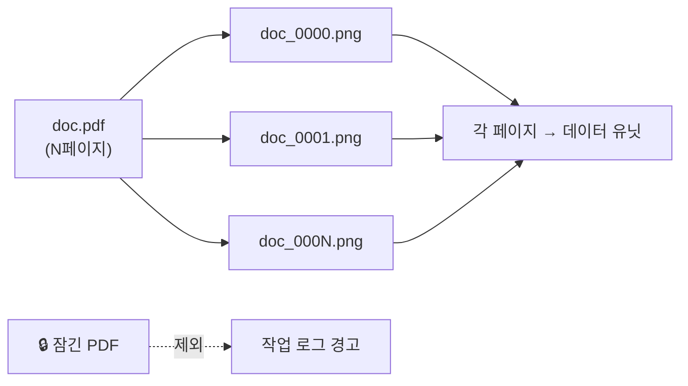
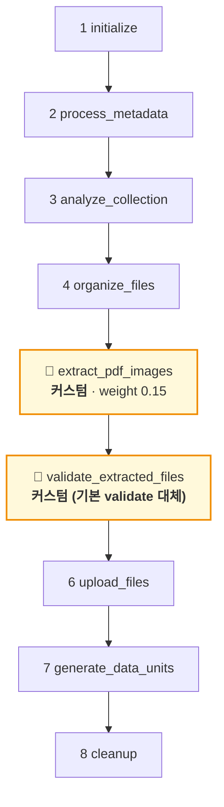
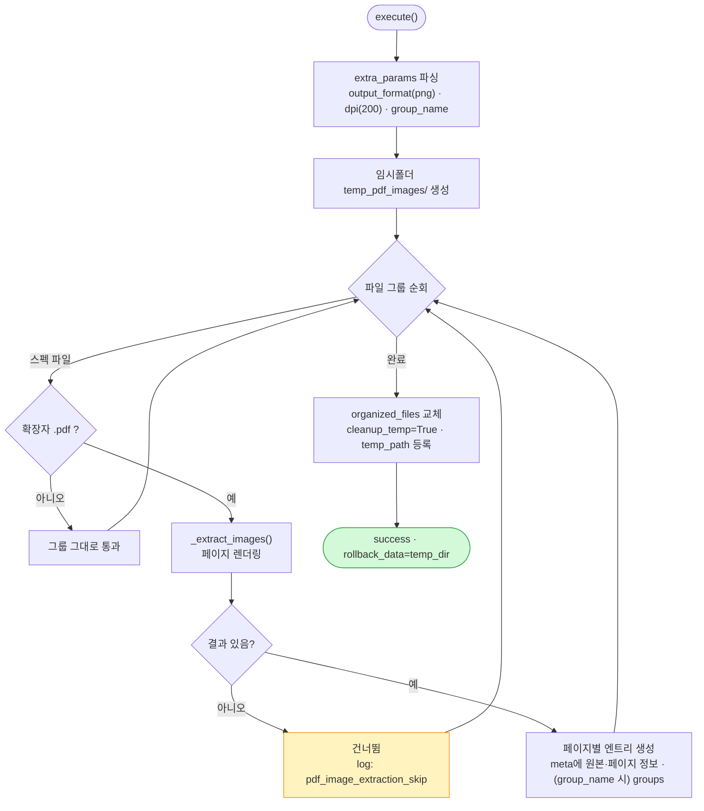
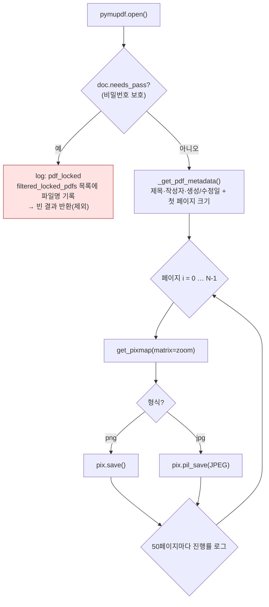
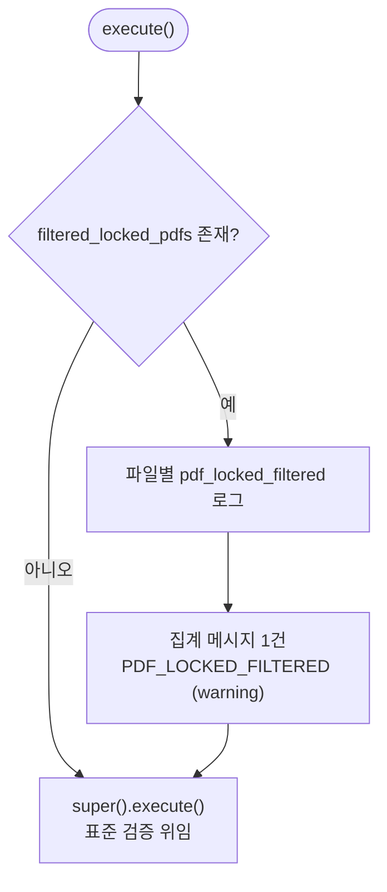

# PDF 전처리 임포트 플러그인 (pdf-to-image-uploader)

**PDF**의 각 페이지를 이미지(PNG/JPG)로 렌더링하여 페이지별로 데이터 유닛을 업로드하는 업로드 플러그인. 잠긴(비밀번호 보호) PDF는 걸러내고 그 사실을 작업 로그에 알립니다.

---

## 1. 플러그인 식별 정보

| 항목 | 값 |
| --- | --- |
| 폴더명 / GitHub 저장소 | `file-spec-uploader-pdf-to-jpg` |
| 코드명 (`config.yaml` → `code`) | `pdf-to-image-uploader` |
| 플러그인 이름 (`config.yaml` → `name`) | `PDF 전처리 임포트 플러그인` |
| 패키지명 (`pyproject.toml` → `name`) | `pdf-to-image-uploader` |
| 버전 | `2.2.0` |
| 카테고리 | `upload` |
| 지원 데이터 타입 | `image` |
| upload 진입점 | `plugin.upload.UploadAction` |

---

## 2. 개요

업로드 직전에 **PDF 페이지를 이미지로 렌더링**하여 페이지 1장 = 데이터 유닛 1개로 업로드합니다. PDF가 아닌 파일은 그대로 통과합니다. 렌더링은 **PyMuPDF**를 사용하며, 해상도는 DPI로 조절합니다. 비밀번호로 잠긴 PDF는 처리에서 제외하고 사용자에게 안내합니다.



### 입/출력 스펙

| 구분 | 내용 |
| --- | --- |
| 대상 확장자 | `.pdf` (허용: image=`.jpg/.jpeg/.png/.pdf`) |
| 출력 형식 | `png`(기본) 또는 `jpg` |
| 페이지 파일명 | `{원본stem}_{페이지번호:04d}.{ext}` |
| DPI → 확대 배율 | `zoom = dpi / 72.0` (`pymupdf.Matrix(zoom, zoom)`) |

---

## 3. 파라미터 (UI 스키마)

| 이름 | 형태 | 설명 | 기본값 |
| --- | --- | --- | --- |
| `output_format` | select | 출력 이미지 형식 (`png` / `jpg`) | `png` |
| `dpi` | number | 페이지 렌더링 해상도(DPI, 72–600) | `200` |
| `group_name` | text | 데이터 유닛에 부여할 묶음 이름 | (없음) |

---

## 4. 전체 업로드 워크플로우

이 플러그인은 커스텀 추출 단계를 삽입하고, **기본 `validate_files`를 교체**합니다.



> 등록: `insert_after('organize_files', ExtractPdfImagesStep())` → `unregister('validate_files')` → `insert_after('extract_pdf_images', ValidateExtractedFilesStep())`

---

## 5. 커스텀 단계 상세

### 5.1 `ExtractPdfImagesStep` (organize_files 직후)

**스킵 판정**: `organized_files`에 PDF가 하나도 없으면 스킵.



#### 페이지 렌더링 & 잠긴 PDF 처리 (`_extract_images`)



- 개별 페이지 렌더 실패 시 해당 페이지만 건너뜀. `finally`에서 `doc.close()`.
- **롤백**: 임시 디렉터리(`temp_pdf_images`) 삭제.

### 5.2 `ValidateExtractedFilesStep` (기본 `validate_files` 대체)

SDK의 `ValidateFilesStep`을 상속하여, **표준 검증 전에** 앞 단계에서 걸러진 잠긴 PDF를 로그로 보고합니다.



### 사용자 로그 메시지 (`log_messages.py`)

`context.log`(Ray 콘솔 전용)와 달리 `event='message'`로 백엔드 UI 작업 로그에 노출됩니다.

| 코드 | 레벨 | 메시지 |
| --- | --- | --- |
| `PDF_LOCKED_FILTERED` | `warning` | `{count}개의 잠긴 PDF 파일이 확인되었습니다. 해당 파일은 처리할 수 없어 업로드에서 제외되었습니다.` |

---

## 6. 생성되는 메타데이터 (페이지별)

| 키 | 설명 |
| --- | --- |
| `origin_file_name` / `origin_file_format`(`pdf`) / `origin_pdf_path` | 원본 정보 |
| `title` / `author` / `subject` / `creator` / `producer` | PDF 메타(존재 시) |
| `creation_date` / `modification_date` | PDF 메타(존재 시) |
| `page_width` / `page_height` | 첫 페이지 크기 |
| `page_count` / `page_index` | 총 페이지 수 / 현재 페이지(1부터) |
| `dpi` / `output_format` | 렌더링 설정 |
| `groups` | `group_name` 지정 시 (선택) |

---

## 7. 테스트

`tests/`에 잠긴 PDF 필터링 관련 테스트가 있습니다.

```bash
uv run pytest        # test_locked_pdf.py, test_validation_filtered_locked.py
```

---

## 8. 의존성

- `synapse-sdk`
- `PyMuPDF`

---

## 9. 설치 / 실행 / 배포

```bash
uv sync
synapse run upload
synapse plugin publish
```
